# Week 6 Milestone — Reusable Terraform + Secrets & Config Management

Goal, per the milestone card: **write reusable, team-ready Terraform and stop
hardcoding secrets anywhere.** This picks up directly from Week 5 — the same
infrastructure, refactored into a shared module, deployed twice independently
(dev + staging), with every secret that was previously baked into `user_data`
moved into AWS Secrets Manager / Parameter Store and fetched at boot instead.

Written the same way as Week 5's README: real command output, screenshots next
to the claim they prove, and every "why," not just every "what" — so future-me
can run this cold without re-deriving any of it from memory.

---

## What was built

| Path | Purpose |
|---|---|
| `modules/month1-infra/` | The entire Week 5 infrastructure, parameterized into a reusable module |
| `environments/dev/` | Calls the module with dev's variables — own state file, own VPC CIDR |
| `environments/staging/` | Calls the *same* module with different variables — independent of dev |
| `modules/month1-infra/secrets.tf` | Secrets Manager (Mongo password) + Parameter Store (everything else) |
| `modules/month1-infra/user_data.sh.tpl` | Rewritten to *fetch* secrets at boot instead of embedding them |
| `.gitignore` | Blocks `secrets.auto.tfvars` — the file real secret values live in, never committed |

---

## 1. Turning Week 5's flat config into a module

A module is just a directory of `.tf` files with a clean set of inputs and
outputs — Week 5's `vpc.tf`, `security_groups.tf`, `ec2.tf`, `iam.tf`, and
`s3.tf` moved into `modules/month1-infra/` almost unchanged. The only real
rewrite was hardcoded values becoming variables:

```hcl
# Before (Week 5, hardcoded):
resource "aws_vpc" "main" {
  cidr_block = "10.0.0.0/16"
}

# After (Week 6, parameterized):
resource "aws_vpc" "main" {
  cidr_block = var.vpc_cidr
}
```

**Two rules that matter more than they look like they should:**

1. **The module itself has no `provider` or `backend` block.** Those live only
   in `environments/dev/` and `environments/staging/`. A module that configured
   its own provider would fight with itself the moment two environments tried
   to call it.
2. **Resource names include `var.environment`** (`${var.environment}-bastion`,
   `${var.environment}-ec2-repository-role`) — otherwise dev and staging would
   collide on IAM role names, which have to be globally unique per account.

---

## 2. The dev/staging split — proof they're actually independent, not copy-pasted

Each environment gets its **own state file**, in the same S3 backend, at a
different `key` — `week6/dev/terraform.tfstate` and
`week6/staging/terraform.tfstate`. Running `apply` in one can never touch the
other's real resources.

```hcl
# environments/dev/main.tf
module "infra" {
  source = "../../modules/month1-infra"

  environment = "dev"
  vpc_cidr    = var.vpc_cidr        # 10.0.0.0/16
  ...
}
```
```hcl
# environments/staging/main.tf — same module, genuinely different values
module "infra" {
  source = "../../modules/month1-infra"

  environment = "staging"
  vpc_cidr    = var.vpc_cidr        # 10.1.0.0/16
  ...
}
```

**Real `terraform plan` output, dev:**
```
Plan: 42 to add, 0 to change, 0 to destroy.

Changes to Outputs:
  + app_public_ip       = (known after apply)
  + app_urls            = { backend, dashboard, frontend }
  + bastion_public_ip   = (known after apply)
  + s3_website_endpoint = (known after apply)
```
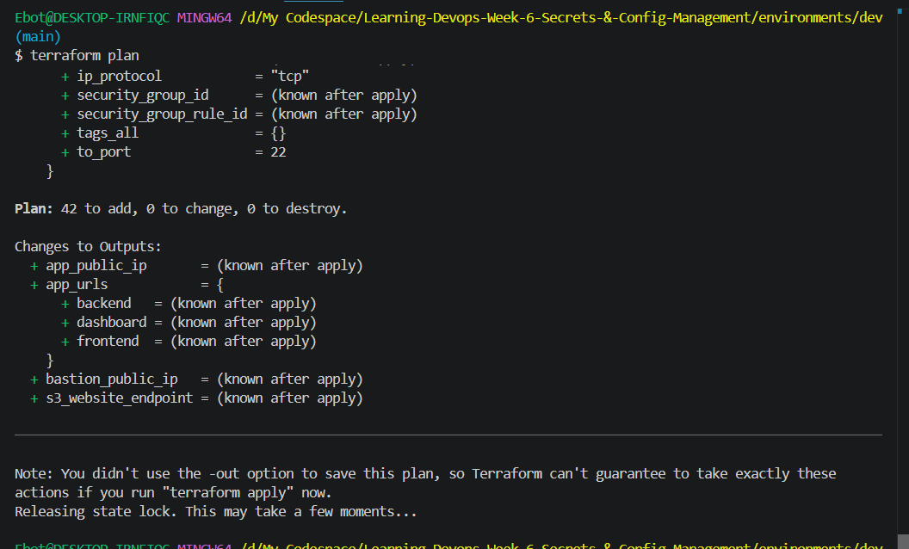

**Real `terraform apply` output, dev** — note the `module.infra.*` prefix on
every resource, proof the module is genuinely doing the work, not a flattened
copy of Week 5's files:
```
module.infra.aws_nat_gateway.main: Creation complete after 2m1s [id=nat-0703813d797f73424]
Apply complete! Resources: 42 added, 0 changed, 0 destroyed.

Outputs:
app_public_ip = "13.49.225.140"
app_urls = {
  "backend" = "http://13.49.225.140:1338/parse/health"
  "dashboard" = "http://13.49.225.140:4041"
  "frontend" = "http://13.49.225.140:3003"
}
bastion_public_ip = "56.228.11.144"
s3_website_endpoint = "ebotprog-week6-dev-milestone-bucket.s3-website.eu-north-1.amazonaws.com"
```
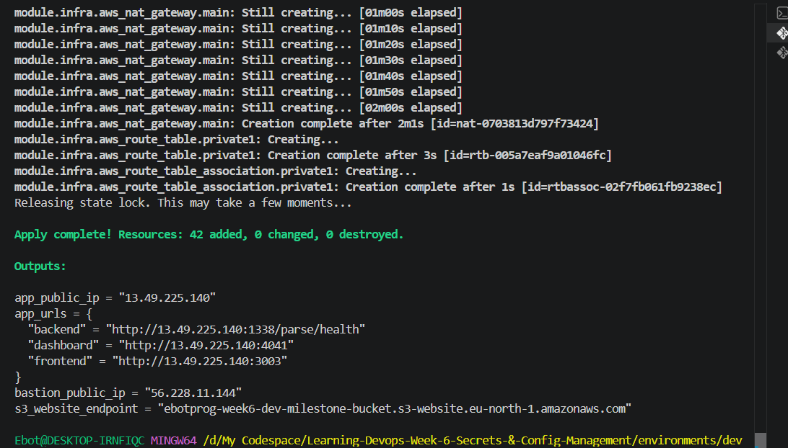

**The actual proof of independence — two different VPC CIDRs, same account:**

| | Dev | Staging |
|---|---|---|
| VPC CIDR | `10.0.0.0/16` | `10.1.0.0/16` |
| Instance size | `t3.micro` | `t3.small` |
| S3 bucket | `ebotprog-week6-dev-milestone-bucket` | `ebotprog-week6-staging-milestone-bucket` |

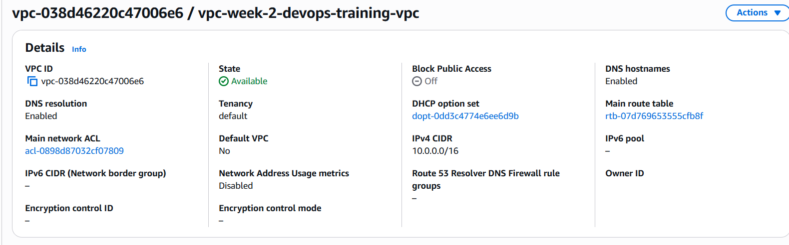
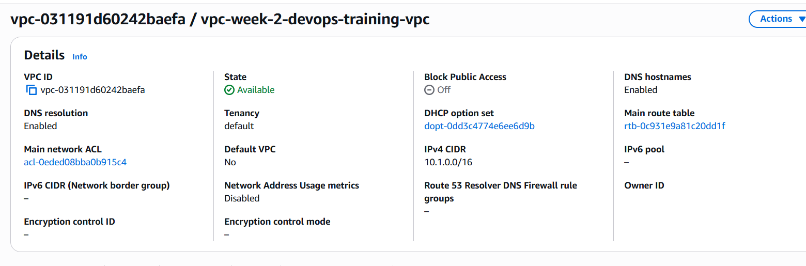

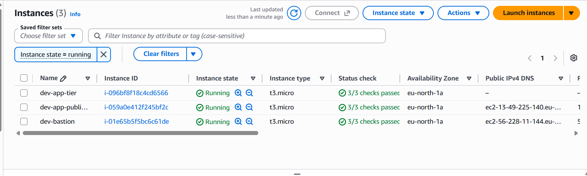

---

## 3. Secrets — Secrets Manager vs. Parameter Store, and why the split

Both services encrypt at rest and integrate with IAM. The real difference is
what each is *for*, and the module reflects that split deliberately rather
than putting everything in one or the other:

| | Secrets Manager | Parameter Store (SecureString) |
|---|---|---|
| Built for | Credentials that need rotation | Static config that doesn't rotate |
| Cost | ~$0.40/secret/month | Free |
| Used here for | `MONGO_ROOT_PASSWORD` only | Everything else |

```hcl
# secrets.tf — the actual split
resource "aws_secretsmanager_secret" "mongo_password" {
  name = "${var.environment}/parse-stack/mongo-root-password"
}

resource "aws_ssm_parameter" "parse_master_key" {
  name  = "/${var.environment}/parse-stack/parse-master-key"
  type  = "SecureString"
  value = var.parse_master_key
}
# ...same pattern for parse_app_id, dashboard_user, dashboard_password
```

The `${var.environment}/parse-stack/...` naming means dev and staging get
completely separate secrets automatically, just from the module being called
twice with a different `environment` value — no manual namespacing needed.

**Real console proof, both environments, side by side:**

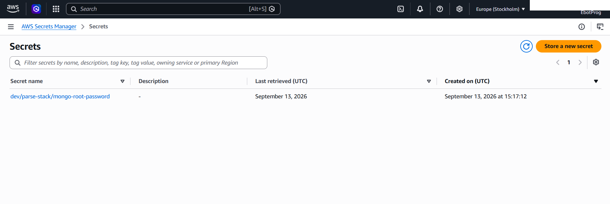


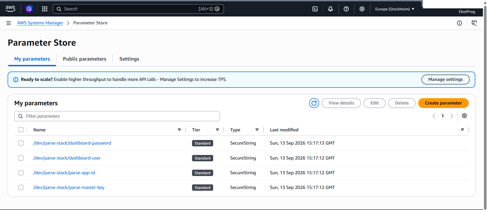
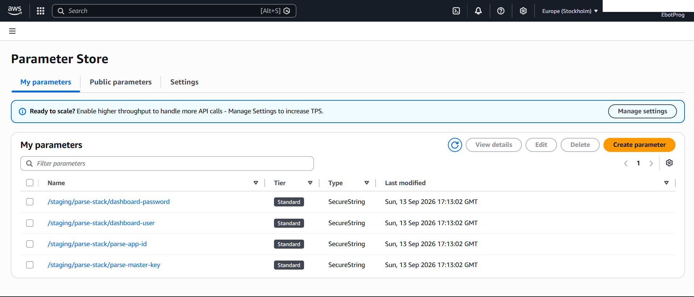

> **On where the actual secret *values* live:** never in a committed `.tf`
> file. Each environment has a `secrets.auto.tfvars` — gitignored, loaded
> automatically by Terraform without needing a `-var-file` flag — containing
> the real passwords. A checked-in `.example` version with placeholder text
> shows the shape without the substance.

---

## 4. IAM — extending the existing role, not creating a new one

The instance already had `ec2-repository-role` from Week 5 for ECR access.
Week 6 adds one more inline policy to that same role, scoped tightly to only
the secrets this specific environment owns:

```hcl
resource "aws_iam_role_policy" "read_secrets" {
  name = "${var.environment}-read-parse-stack-secrets"
  role = aws_iam_role.ec2_repository_role.id

  policy = jsonencode({
    Statement = [
      {
        Action   = ["secretsmanager:GetSecretValue"]
        Resource = [aws_secretsmanager_secret.mongo_password.arn]
      },
      {
        Action   = ["ssm:GetParameter"]
        Resource = ["arn:aws:ssm:${var.region}:${account_id}:parameter/${var.environment}/parse-stack/*"]
      }
    ]
  })
}
```

Note the `Resource` is scoped to `/${var.environment}/parse-stack/*` — dev's
instance role can read dev's secrets, and (by construction, not by luck)
cannot read staging's, since the ARN pattern simply doesn't match.

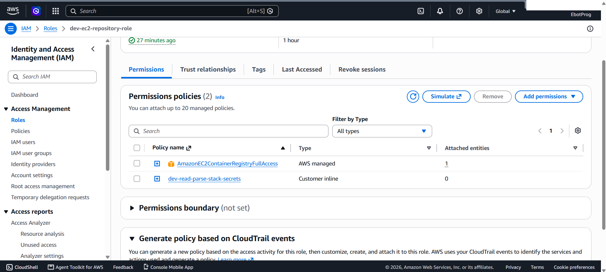

---

## 5. `user_data.sh.tpl` — fetching secrets at boot instead of baking them in

This is the actual heart of the milestone. Week 5's version wrote a `.env`
file with literal hardcoded values. Week 6's version fetches every value from
AWS at boot time, using the instance's own IAM role — no keys, no plaintext
secrets anywhere in the Terraform code itself:

```bash
MONGO_ROOT_PASSWORD="$(aws secretsmanager get-secret-value \
  --secret-id "${environment}/parse-stack/mongo-root-password" \
  --region ${region} --query SecretString --output text)"

PARSE_MASTER_KEY="$(aws ssm get-parameter \
  --name "/${environment}/parse-stack/parse-master-key" \
  --with-decryption --region ${region} --query 'Parameter.Value' --output text)"

# ...same pattern for parse_app_id, dashboard_user, dashboard_password

cat > .env <<ENVEOF
MONGO_ROOT_PASSWORD=$MONGO_ROOT_PASSWORD
PARSE_MASTER_KEY=$PARSE_MASTER_KEY
...
ENVEOF
chown ubuntu:ubuntu .env
chmod 600 .env
```

`${environment}` and `${region}` are genuine Terraform template variables
(substituted once, at `apply` time, via `templatefile()`); `$MONGO_ROOT_PASSWORD`
is a plain bash variable, substituted on the instance itself at boot. Mixing
these two substitution styles in one file is easy to get wrong — Terraform
only touches `${...}` patterns, so every bash variable here deliberately uses
bare `$VAR`, not `${VAR}`, to stay untouched by the template engine.

**Real proof this actually worked** — `.env` on the instance, showing real
fetched values (not the literal placeholder text), values themselves blurred
since the point of the screenshot is that the fetch happened, not to publish
the passwords:

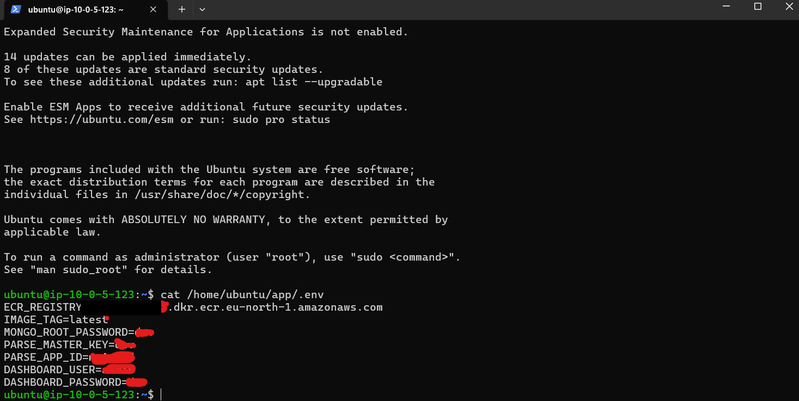
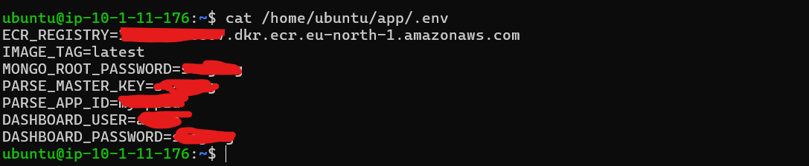

---

## 6. Verifying both environments actually work, independently

```
docker ps
```
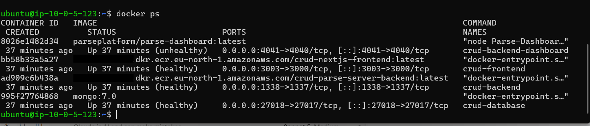
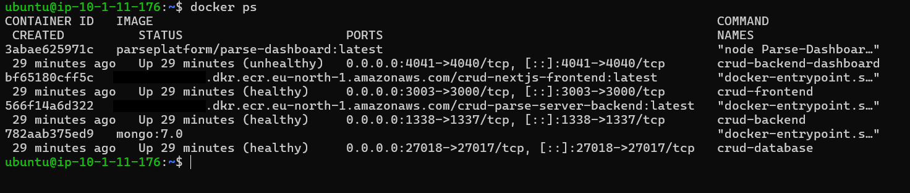

> **Honest note, not glossed over:** `crud-backend-dashboard` shows
> `(unhealthy)` in both environments, while frontend/backend/database are all
> `(healthy)`. The dashboard is still reachable in the browser (below) despite
> this — worth investigating properly before calling this fully clean, but it
> didn't block verifying the actual milestone (module reuse + secrets fetch),
> so it's flagged here rather than silently hidden or falsely marked fixed.

**Both frontends, live, independently:**

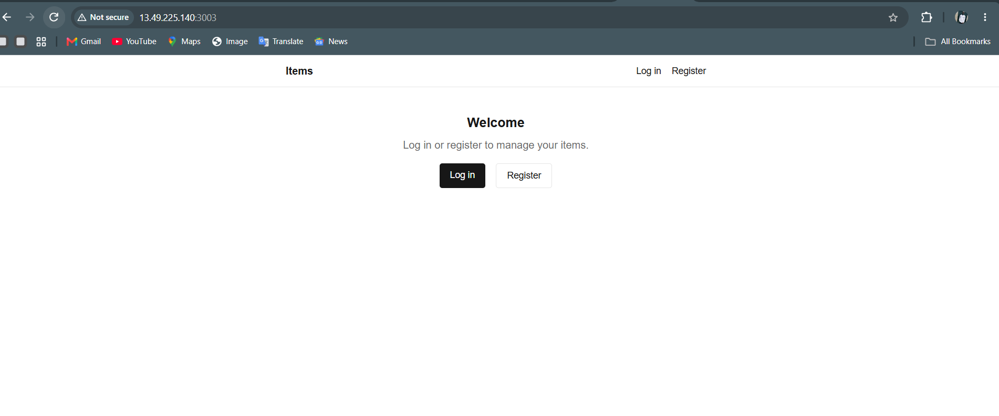
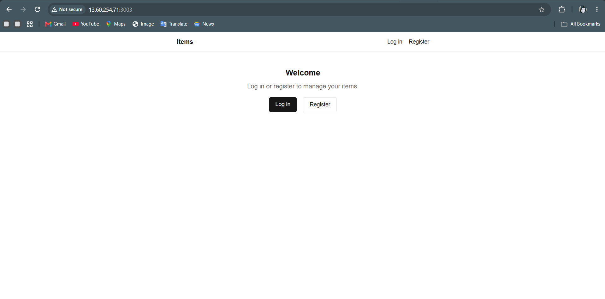

**Both dashboards:**

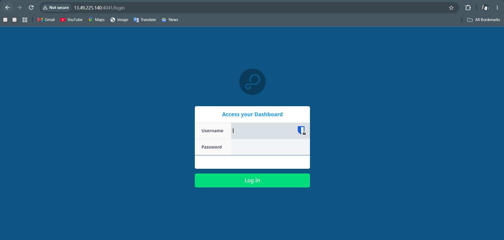
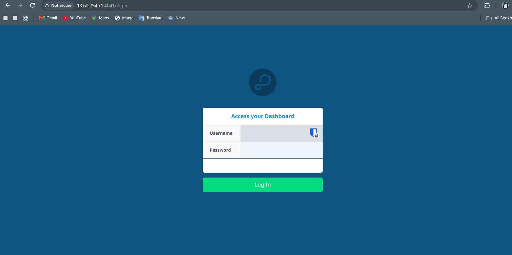

**Both static sites** (the Terraform-managed `index.html` from the shared
module — same file, deployed to two different buckets):

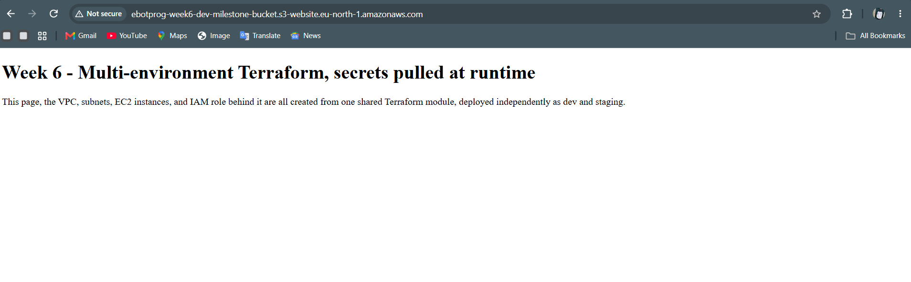
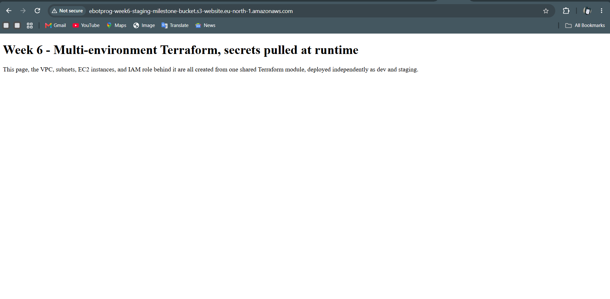

---

## 7. Secret scanning — two repos, two different results, both legitimate

The milestone asks to scan "the entire repo history" — worth being precise
about *which* repo, since two exist here for different reasons.

### 7.1 — The Week 6 Terraform repo itself

```
gitleaks git -v
```
```
1 commits scanned.
scanned ~38786 bytes (38.79 KB) in 1.08s
no leaks found
```
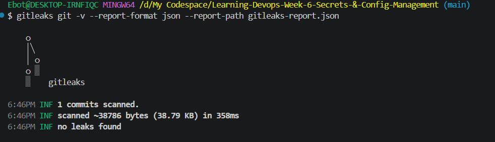

This one is *genuinely* clean, not just reported clean — confirmed by also
checking that the secrets file was never tracked in the first place, not just
trusting the scanner:
```bash
git log --all --full-history -- '*secrets.auto.tfvars'
# (prints nothing — never committed, not even once)
```

### 7.2 — The Week 3 app repo (where the real secret actually lived)

Same scan, same clean result:
```
6 commits scanned.
no leaks found
```

**But this one deserved a second look, and it was right to check further.**
Gitleaks' rules mostly match plain assignment patterns (`key = "value"`); they
don't specifically account for Docker Compose's `${VAR:-default}` shell
interpolation syntax. A direct history search for a specific known credential
from an earlier session found it *was* in fact committed:

```bash
git log -p --all | grep -i "WLRQqhadcYQGqyfC"
```
```
-      MONGO_INITDB_ROOT_PASSWORD: ${MONGO_ROOT_PASSWORD:-WLRQqhadcYQGqyfC}
+      MONGO_INITDB_ROOT_PASSWORD: ${MONGO_ROOT_PASSWORD:-WLRQqhadcYQGqyfC}
```

**Resolution:** the value is already dead — Week 6's actual Mongo password
(in Secrets Manager, per environment) is a newly generated value, confirmed
different from this one. No further action was strictly required, but this is
exactly the kind of finding worth writing down rather than hiding: **an
automated tool saying "clean" is not the same as a credential never having
been exposed**, and the milestone's real lesson is catching that gap, not
just running a command and trusting its silence.

---

## 8. Common pitfalls, worth knowing before hitting them again

- **A module that configures its own provider or backend.** Breaks the moment
  two environments call it. Provider/backend config belongs only in
  `environments/*/`.
- **Resource names without `${var.environment}` baked in.** IAM role names
  are unique per account — two environments both trying to create
  `ec2-repository-role` (no prefix) would collide the moment the second
  `apply` runs.
- **A Terraform variable that "solves" hardcoding but still has a default.**
  `variable "mongo_root_password" { default = "changeme" }` defeats the
  entire point exactly as thoroughly as a literal string in `user_data` did.
  No secret variable in this module has a default, on purpose.
- **Mixing `${...}` Terraform interpolation and bash `${VAR}` syntax in the
  same `templatefile()`.** Bash variables that need to survive untouched into
  the rendered script must use bare `$VAR`, never `${VAR}` — the brace form
  is exactly what Terraform's template engine looks for.
- **Trusting a clean secret-scan result without a reason to double check.**
  Gitleaks' rule set has real blind spots (shell-interpolation defaults being
  one of them here). A known-suspicious credential is worth a direct `git log
  -p | grep` regardless of what the automated tool reports.

---

## Deliverables checklist, mapped to the milestone card

- [x] `modules/` — Week 5's infrastructure, refactored into a reusable module
- [x] `environments/dev` and `environments/staging` — same module, different
      variables, independent state files, independently verified working
- [x] Mongo connection string and Parse app secrets moved to Secrets Manager
      / Parameter Store, out of every `.env`/`user_data` file
- [x] Container startup updated to pull secrets at boot — confirmed via real
      `.env` contents on both instances
- [x] `gitleaks` run across both relevant repos' full history
- [x] README with the scan results **and** the manual finding gitleaks missed
      — documented honestly, not silently fixed
