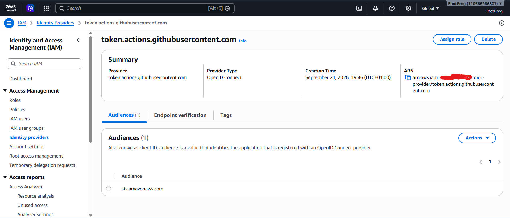
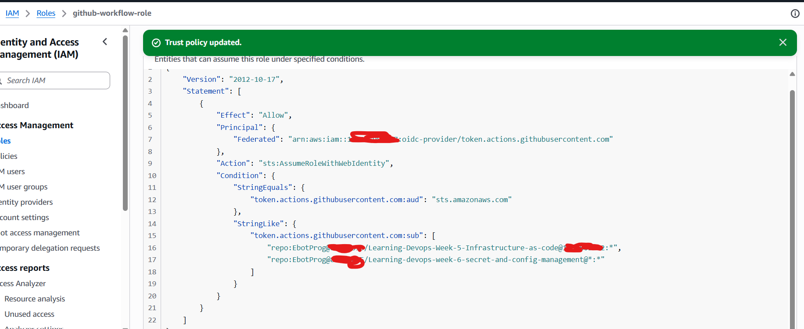
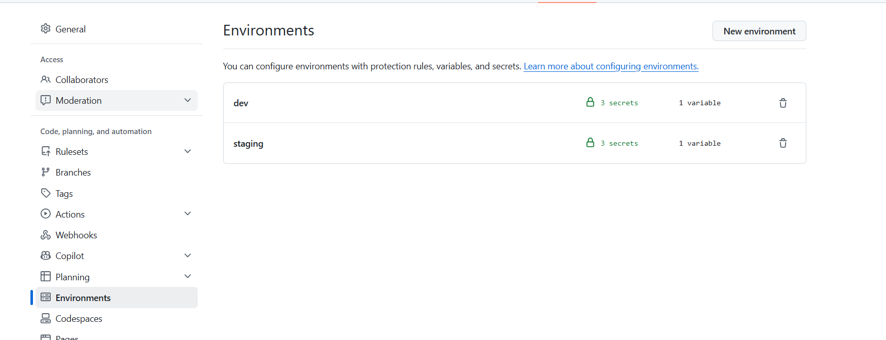
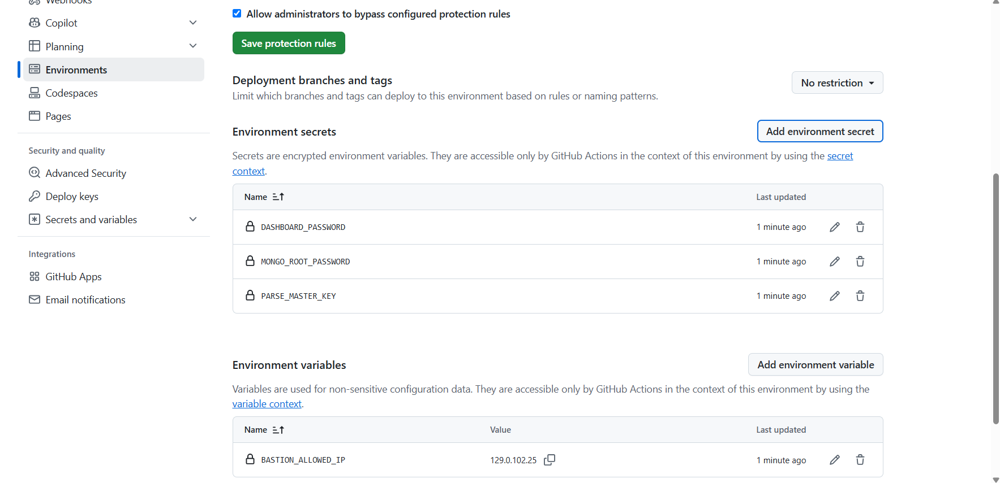

# CI/CD Pipeline — Terraform on AWS via GitHub Actions (Week 6)

Repo: `Learning-devops-week-6-secret-and-config-management`

This document explains how the GitHub Actions pipeline for this Week 6 project was set up, what's different from Week 5 (mainly: per-environment secrets/config), and every issue that came up while building it.

> **Folder structure this README expects:**
>
> ```
> project-root/
> ├── README.md                     ← this file
> ├── screenshots/
> │   ├── identity-provider.png
> │   ├── role-to-be-assumed-by-workflow.png
> │   ├── environments-list.png
> │   ├── environment-secrets-and-variables.png
> │   ├── dev/        ← other (non-pipeline) screenshots for this environment
> │   └── staging/    ← other (non-pipeline) screenshots for this environment
> ├── environments/
> │   ├── dev/
> │   └── staging/
> ├── modules/
> └── .github/
>     └── workflows/
>         ├── terraform.yml
>         └── terraform-destroy.yml
> ```
>
> The four pipeline-setup screenshots above live at the **root** of `screenshots/`, not inside `dev/` or `staging/`, since they document the pipeline itself rather than a specific environment's resources.

---

## 1. What's different from Week 5

Week 5 was a **single, flat** Terraform project — one VPC, one bastion, one app instance, deployed as one thing with plain repository-level variables (`AWS_ROLE_ARN`, `BASTION_ALLOWED_IP`) and no matrix at all. Week 6 introduces **two things at once**: a `dev`/`staging` **matrix** (splitting the project into `environments/dev` and `environments/staging`, each provisioned from a shared `modules/month1-infra` module), and **per-environment secrets and config** via **GitHub Environments**, so `dev` and `staging` each get their own isolated secrets/variables instead of sharing repo-level ones. The IAM role is also extended to trust **two repositories** instead of one.

Two workflows exist here:

- **`terraform.yml`** — `fmt` → `validate` → `plan` on PRs/pushes, `apply` after a push to `main`, matrixed over `dev` and `staging`.
- **`terraform-destroy.yml`** — manual, `workflow_dispatch`-only teardown with a typed confirmation input.

---

## 2. Reused from Week 5: the OIDC identity provider

The GitHub OIDC identity provider is registered **once per AWS account**, not once per repo — so this Week 6 project reuses the exact same provider that Week 5 created.


_Same GitHub OIDC provider (`token.actions.githubusercontent.com`, audience `sts.amazonaws.com`) used by both the Week 5 and Week 6 repos._

---

## 3. Extending the IAM role to trust a second repository

Rather than creating a brand-new role for this project, the existing `github-workflow-role` from Week 5 was reused and its **trust policy** extended to also allow this Week 6 repo to assume it, by turning the `sub` condition into a list — one pattern per repo.


_Trust policy on `github-workflow-role`, now trusting two repos: the Week 5 infra repo and this Week 6 repo._

```json
{
  "Version": "2012-10-17",
  "Statement": [
    {
      "Effect": "Allow",
      "Principal": {
        "Federated": "arn:aws:iam::<ACCOUNT_ID>:oidc-provider/token.actions.githubusercontent.com"
      },
      "Action": "sts:AssumeRoleWithWebIdentity",
      "Condition": {
        "StringEquals": {
          "token.actions.githubusercontent.com:aud": "sts.amazonaws.com"
        },
        "StringLike": {
          "token.actions.githubusercontent.com:sub": [
            "repo:EbotProg@<ownerID>/Learning-Devops-Week-5-Infrastructure-as-code@<repoID>:*",
            "repo:EbotProg@<ownerID>/Learning-devops-week-6-secret-and-config-management@<repoID>:*"
          ]
        }
      }
    }
  ]
}
```

**Important caveats carried over from Week 5:**

- The `sub` claim for this GitHub account comes back in the **ID-suffixed format** (`repo:owner@<ownerID>/repo@<repoID>:...`), not the plain `repo:owner/repo:*` format — confirmed earlier by decoding the OIDC token in a debug step (see the Week 5 README).
- A shared role means **both repos get identical permissions**. Since both Week 5 and Week 6 manage similar AWS resources (VPC, EC2, Secrets Manager) under the same account, this was an acceptable simplification here — but if the two projects ever needed different permission scopes, separate roles per repo would be the safer design.

---

## 4. Per-environment secrets and variables (the core of Week 6)

Instead of repository-wide secrets, this project uses **GitHub Environments** (`dev`, `staging`), each with its own isolated secrets and variables — so a value in `dev` can differ from `staging`, and a workflow job only sees the ones for the environment it's running against.


_Settings → Environments, showing `dev` and `staging`, each with 3 secrets and 1 variable._

Drilling into one environment:


_Example of one environment's configuration: three encrypted secrets and one plain-text variable._

| Type     | Name                  | Scope            | Purpose                                                                 |
| -------- | --------------------- | ---------------- | ----------------------------------------------------------------------- |
| Secret   | `DASHBOARD_PASSWORD`  | per environment  | Fed into `TF_VAR_dashboard_password`                                    |
| Secret   | `MONGO_ROOT_PASSWORD` | per environment  | Fed into `TF_VAR_mongo_root_password`                                   |
| Secret   | `PARSE_MASTER_KEY`    | per environment  | Fed into `TF_VAR_parse_master_key`                                      |
| Variable | `BASTION_ALLOWED_IP`  | per environment  | Fed into `TF_VAR_bastion_allowed_ip`                                    |
| Variable | `AWS_ROLE_ARN`        | repository level | ARN of the shared `github-workflow-role`, same across both environments |

`AWS_ROLE_ARN` is kept at the **repository** level (not duplicated per environment) since the same role is assumed regardless of which environment is deploying — only the environment-scoped secrets/variables actually differ between `dev` and `staging`.

In the workflow, each job binds itself to the matching environment so GitHub knows which set of secrets/variables to expose:

```yaml
jobs:
  plan:
    strategy:
      matrix:
        environment: [dev, staging]
    environment: ${{ matrix.environment }}
    steps:
      - name: Plan
        run: terraform plan -input=false -out=tfplan
        env:
          TF_VAR_mongo_root_password: ${{ secrets.MONGO_ROOT_PASSWORD }}
          TF_VAR_parse_master_key: ${{ secrets.PARSE_MASTER_KEY }}
          TF_VAR_dashboard_password: ${{ secrets.DASHBOARD_PASSWORD }}
          TF_VAR_bastion_allowed_ip: ${{ vars.BASTION_ALLOWED_IP }}
```

Because `environment: ${{ matrix.environment }}` is set on the job, `secrets.*` and `vars.*` resolve to whichever environment that matrix leg is currently running as — `dev`'s job sees `dev`'s secrets, `staging`'s job sees `staging`'s.

---

## 5. Job flow, high level

Same artifact-based plan/apply handoff pattern as Week 5's single-leg version, just matrixed per environment with environment-scoped secrets — Week 5 had one `plan`/`apply` pair; Week 6 runs one of each per environment:

```
        plan (dev)         plan (staging)
   [dev secrets/vars]    [staging secrets/vars]
     terraform plan       terraform plan
     -out=tfplan           -out=tfplan
           │                     │
   upload artifact        upload artifact
   "tfplan-dev"            "tfplan-staging"
           │                     │
           ▼                     ▼
        apply (dev)        apply (staging)
   download "tfplan-dev"  download "tfplan-staging"
   terraform apply tfplan  terraform apply tfplan
```

- `plan` writes a binary plan file and uploads it as an artifact labelled `tfplan-<environment>`.
- `apply` downloads that exact artifact and applies it — the file on disk is always just called `tfplan`; the `tfplan-<environment>` name is only the artifact's storage label, never the actual filename (see Issue #2 below).
- `apply` has `needs: plan` and only runs on push to `main`.

---

## 6. Setup checklist (order that actually worked)

1. Confirm the OIDC identity provider already exists in IAM (reused from Week 5 — nothing to create here).
2. Edit `github-workflow-role`'s trust policy: change the single `sub` string into a list, adding this repo's pattern alongside Week 5's.
3. Create two GitHub **Environments** in this repo: `dev` and `staging` (Settings → Environments → New environment).
4. Under each environment, add `DASHBOARD_PASSWORD`, `MONGO_ROOT_PASSWORD`, `PARSE_MASTER_KEY` as environment secrets, and `BASTION_ALLOWED_IP` as an environment variable — values may differ between `dev` and `staging`.
5. Add `AWS_ROLE_ARN` as a **repository**-level variable (shared by both environments).
6. Add `environment: ${{ matrix.environment }}` to each job in the workflow so it resolves the right environment's secrets/variables.
7. Add the workflow files under `.github/workflows/`.
8. Push a small test change under `environments/**` or `modules/**`, confirm both matrix legs plan against their own secrets correctly, then confirm apply.

---

## 7. Issues hit while building this pipeline (and fixes)

**1. Empty `bastion_allowed_ip` produced an invalid CIDR (`/32` with no IP)**
`vars.BASTION_ALLOWED_IP` wasn't set for the environment being run, so GitHub silently resolved it to an empty string — Terraform received `TF_VAR_bastion_allowed_ip=""`, and `"${var.bastion_allowed_ip}/32"` became just `"/32"`, which AWS rejected as an invalid CIDR. This is specific to the per-environment setup: a variable set on one environment (e.g. `dev`) doesn't automatically exist on the other (`staging`) — each environment's variables must be added independently. Fixed by setting `BASTION_ALLOWED_IP` explicitly under **both** environments, and confirming the Terraform variable expects a bare IP (the `/32` is appended in `security_groups.tf`, not stored in the variable itself).

**2. `terraform apply tfplan-dev` → "no such file or directory"**
Confused the **artifact name** (`tfplan-dev`, the GitHub storage label used by `upload-artifact`/`download-artifact`) with the **actual filename on disk** (`tfplan`, from `-out=tfplan`). Neither upload nor download renames the file itself. Fixed by using the literal filename in the apply command:

```yaml
run: terraform apply -input=false -auto-approve tfplan
```

**3. `environment`/`environments` directory typo in the apply job's `download-artifact` step**
`path: environment/${{ matrix.environment }}` (singular) extracted the plan into a sibling folder the `apply` step's `working-directory` (`environments/${{ matrix.environment }}`, plural) never looked in. No error was thrown at download time — it just created a new folder and silently succeeded, and the failure only showed up later at `terraform apply`. Confirmed with a quick `ls -la` debug step. Fixed by aligning every occurrence (`working-directory`, both `upload-artifact` and `download-artifact` `path:` fields, and the trigger `paths:` filter) to the same plural spelling. This is a Week 6-only issue — Week 5 has no `environments/` folder at all, so this typo couldn't have existed there; worth a full grep across _this_ workflow file if it resurfaces, rather than assuming one correction caught every occurrence.

**4. `CreateSecret` failed — "already scheduled for deletion"**
AWS Secrets Manager doesn't delete secrets immediately; a destroyed secret enters a recovery window (default 30 days) during which the name can't be reused. A later `apply` recreating that secret fails until it's force-deleted or restored:

```bash
aws secretsmanager delete-secret \
  --secret-id dev/parse-stack/mongo-root-password \
  --force-delete-without-recovery --region eu-north-1
```

For frequently destroyed dev/test environments, consider `recovery_window_in_days = 0` on those secret resources (keep the default window for staging/production).

**5. Destroy workflow stuck on "Waiting for a runner to pick up this job"**
`runs-on: ubuntu-release` is not a valid runner label (valid ones: `ubuntu-latest`, `ubuntu-22.04`, etc.). Since no runner — hosted or self-hosted — matches that label, the job queues forever with no error. An indefinitely "waiting for runner" job (rather than a clear failure) is a strong signal to check `runs-on:` first. Fixed by correcting it to `ubuntu-latest`.

**6. Stuck/queued jobs don't retroactively pick up a fix**
After fixing the `runs-on` typo, the already-queued destroy run needed to be manually **cancelled** from the Actions tab and re-triggered — it doesn't resume or self-correct. Also worth noting: running `destroy` and `apply` concurrently against the same state backend won't corrupt state (S3/DynamoDB locking prevents that — one job just fails with a "state is locked" error and can be re-run), but it can still cause confusing _logical_ errors if both act on the same resources at once. Best to avoid overlapping destroy/apply runs even though locking makes them non-destructive.

---

## 8. Useful debug snippets

**Confirm what's actually on disk before an apply step:**

```yaml
- name: Debug - list working directory
  run: |
    pwd
    ls -la
```

**Force-delete a secret stuck in a Secrets Manager recovery window:**

```bash
aws secretsmanager delete-secret \
  --secret-id <env>/<path>/<secret-name> \
  --force-delete-without-recovery --region <region>
```

**Confirm which environment's secrets a job actually resolved:**
Add a harmless debug step that checks presence without printing the value:

```yaml
- name: Debug - confirm secret is set (without leaking it)
  run: |
    if [ -z "${{ secrets.MONGO_ROOT_PASSWORD }}" ]; then
      echo "MONGO_ROOT_PASSWORD is EMPTY for this environment"
    else
      echo "MONGO_ROOT_PASSWORD is set"
    fi
```
